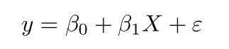
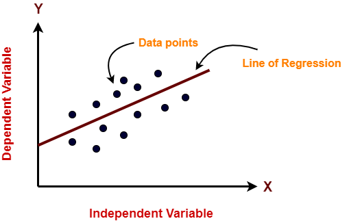
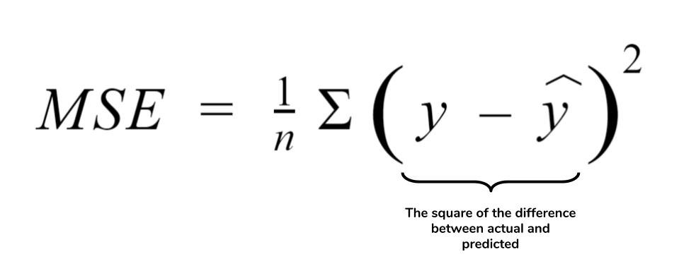
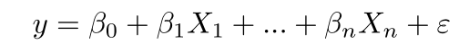
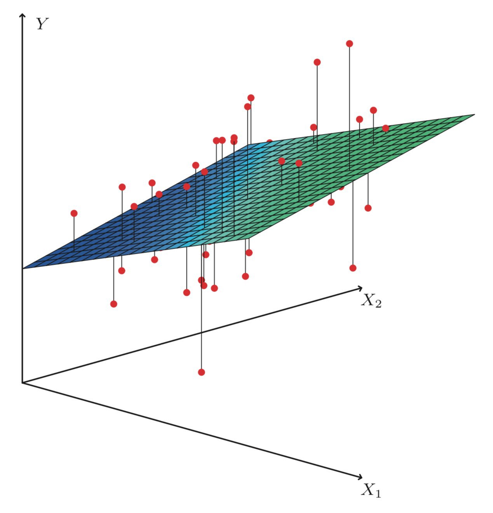
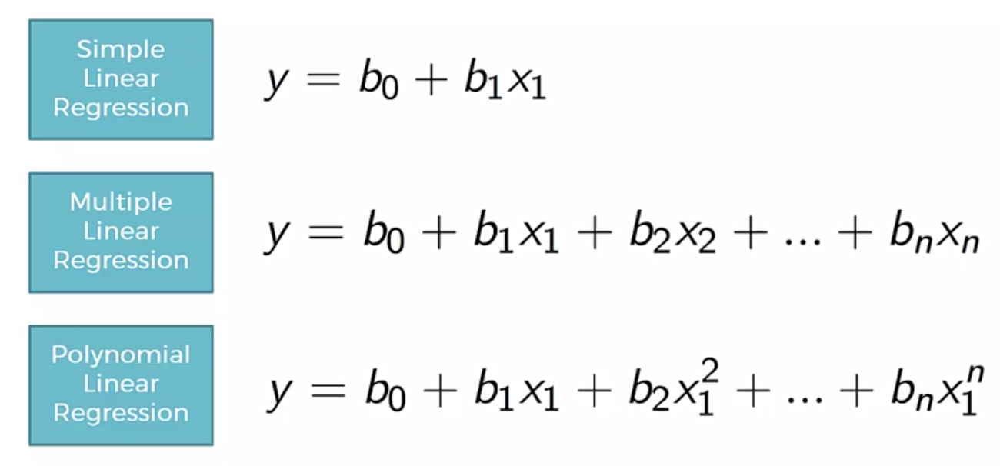
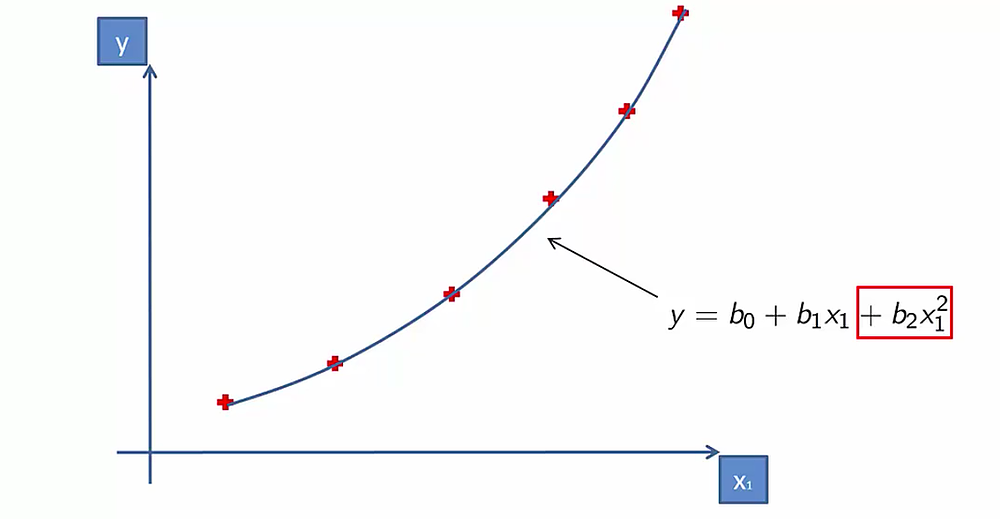

# 数学模型
## 简单线性回归




卡片： 
    两个变量之间的关系
    e 是误差


- 可视化训练和测试集
    - 训练集结果——
    ```python
    from sklearn.linear_model import LinearRegression
    regressor = LinearRegression()
    regressor.fit(I_Train_data, D_Train_data)
    preds = regressor.predict(X_test)
    ```

    - 测试集结果——
    ```python
    import matplotlib.pyplot as plt
    # Visualizing the Training set results
    plt.scatter(X_train, y_train, color = 'green')
    plt.plot(X_train, regressor.predict(X_train), color = 'blue')
    plt.xlabel('Independent Variable set')
    plt.ylabel('Dependent Variable set')
    plt.show()
    ```


> 在每个 x 值处测量观察到的 y 值与预测 y 值的距离;  
> 将这些距离中的每一个平方并计算每个平方距离的平均值。


## 多元线性回归

- 它用于估计两个或多个自变量与一个因变量之间的关系。当您要建立时使用它：
    1. 关系强度——两个或多个自变量与一个因变量之间的关系有多强
    2. 因变量的值在自变量的某个值处。







## **为了找到最佳拟合线，它计算了 3 个参数**

- 模型的t -stat
- 相关的p值
- 回归系数


```python
#将多重线性回归拟合到训练集
from sklearn.linear_model import LinearRegression regressor 
= LinearRegression() regressor.fit 
(X_train, y_train)
#预测测试集结果
y_pred = regressor.predict(X_test)
X = np.append(arr = np.ones((20, 1)).astype(int), values = X, axis = 1) 
X_opt = X[:, [0, 1, 2, 3, 4, 5 ]] 
regressor_OLS = sm.OLS(endog = y, exog = X_opt).fit() regressor_OLS.summary 
() 
    
X_opt = X[:, [0, 1, 3, 4, 5]] 
regressor_OLS = sm.OLS(endog =y, exog=X_opt).fit() regressor_OLS.summary 
() 
X_opt = X[:, [0, 3, 4, 5]] 
regressor_OLS = sm.OLS(endog=y, exog=X_opt).fit() regressor_OLS.summary 
() 
X_opt = X[:, [0, 3, 5]] 
regressor_OLS = sm.OLS(endog=y, exog=X_opt).fit() regressor_OLS.summary 
() 
X_opt = X[:, [0 , 3]] 
regressor_OLS = sm.OLS(endog=y, exog=X_opt).fit() regressor_OLS.summary( 
)
```

---
## 多项式回归
（多层回归、曲线补齐）



```python
# 将多项式回归拟合到数据集
从 sklearn.preprocessing导入 PolynomialFeatures
聚= 多项式特征（度= 3 ）
X_poly =  poly.fit_transform(X)
poly.fit(X_poly, y)
l = 线性回归（）
l.fit(X_poly, y)
```

- 可视化
    ```python
    plt.scatter(X, y, color =  'green')
    plt.plot(X, l.predict(poly.fit_transform(X)), color =  'red')
    plt.title('多项式回归')
    plt.show()
    ```