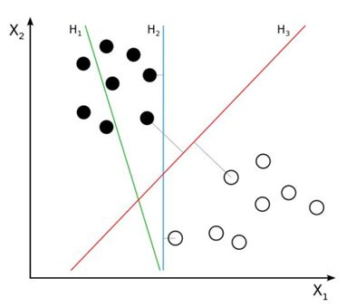

## 支持向量回归

**(Support Vector Regression)**  

## 决策树回归

**(Decision Tree Regression)**  

## 随机森林回归

**(Random Forest Regression)**  

大概以上是影响决策思维的最主要的路标了。？
y = x^T * w (w是模型的权重)

道理： 因为线性回归，只是线性方法，对标量y和一个或者多个维度之间的关系进行建模的，仅仅是最小化了最小二乘误差（感觉这个回归也是挺有道理，接下来看看更牛逼的🐂？ ）

```math
Loss(w) = Sum_1_N(x_n^T * w — y_n) ^ 2 → min(w)
```

这是一个怎么样的数学模型呢？
它支持数据中存在非线性并提供有效的预测模型。

先了解什么是支持向量
  


上图是超平面的诠释，超平面大概是将两组数据区分出来，找出他们整体中来看，两组数据差异，从超平面最近的点，是支持向量，这个向量点距离超平面尽可能的大。支持向量机就是去找这个超平面究竟在哪里，使两组数据分开。

## 决策树

### 支持向量回归

要构建 SVR：

* 收集训练集并选择内核及其参数
* 定义相关矩阵。
* 训练并计算出收缩系数以创建估算器。
* 计算相关向量。

```python
from sklearn.svm import SVR 
regressor = SVR(kernel = 'rbf')
regressor.fit(X, y) 
y_pred = regressor.predict(3.7)
y_pred = ss_y.inverse_transform(y_pred)
```

其中内核可以是线性的、高斯的等

## 随机森林回归

由决策树算法构建（它通过取不同树的输出的平均值或平均值来预测结果）
分类和数字输入变量
```python 
from sklearn.ensemble import RandomForestRegressor regressor 
= RandomForestRegressor(n_estimators=10, random_state=0) regressor.fit(X, y)     
y_pred = regressor.predict(4.2)
```


# 调到了另一个channel， 构建机器学习管道
预处理、特征提取、模型拟合、性能和验证。